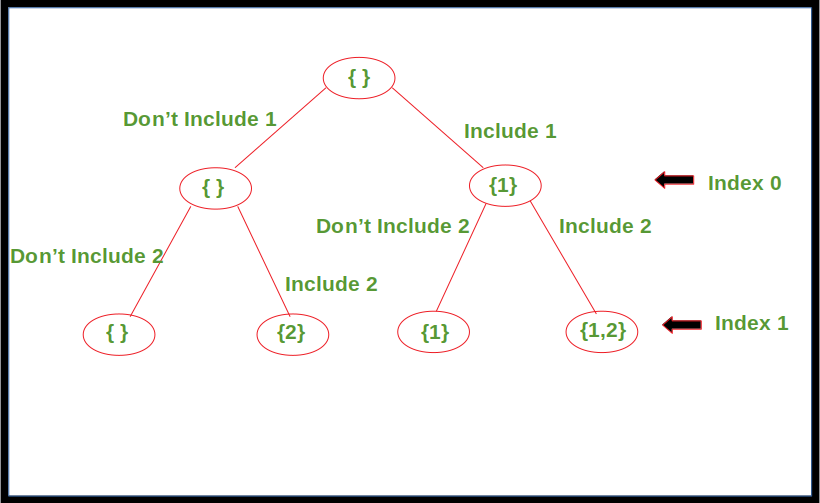
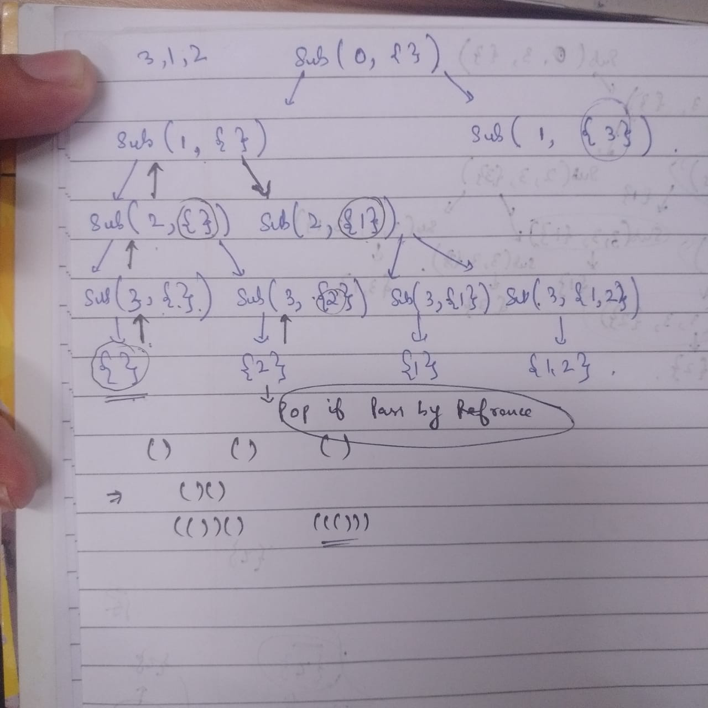

# stack complexity = O(n) bcx n fns in stack 

# The array is passed by pointer.
- we pass the pointer of first variable 
#include <iostream>
using namespace std;

void reverse(int arr[]) {
    cout << arr[0];
}

int main() {
    int arr[3] = {1, 2, 3};
    reverse(arr);
}

# Pass by refrence
void reverse (int (&arr)[3]) {
cout << arr[0];
}

# Fibonacci Tree 

# subsequences 

# subsequences passing arr2 with refrence and without refrence 
sub(i+1,arr,n, arr2);
arr2.push_back(arr[i]);
sub(i+1,arr,n, arr2);
arr2.pop_back();

an extra { arr2.pop_back(); } is needed if pass by refrence else not needed 

# making fn bool and adding returns makes it only once executable ie matches and returns true to all the fn calls in the stack and no more calls happen
 
